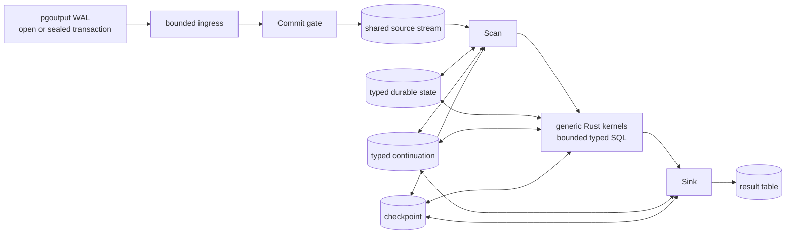

# Shiba

[](https://github.com/frelion/shiba/actions/workflows/ci.yml)
[](https://github.com/frelion/shiba/releases)
[](LICENSE)

Shiba is a PostgreSQL 17 extension for continuously maintained SQL result
tables. It stages streamed WAL in bounded batches, publishes only committed
source transactions into a stateful dataflow, and applies the final effects to
an ordinary PostgreSQL table.

Status: experimental v0.1. Shiba is single-node and asynchronous.

## How it works



Source DML becomes weighted rows:

```text
INSERT row       => (+1, row)
DELETE old       => (-1, old)
UPDATE old → new => (-1, old), (+1, new)
```

Ingress persists bounded batches of a large source transaction before the
trailing pgoutput `Commit` record, but those batches remain invisible to the
DAG. After Commit, the publisher releases them as bounded source chunks.
Operators consume bounded row-and-byte prefixes and persist a continuation
when more work remains. A high-fanout Join therefore produces bounded chunks
instead of materializing its full output in one transaction.

Aggregate, Window, and TopN separate input Apply from output Drain. Apply
advances consumed chunks and records dirty state; Drain later rebuilds and
publishes output in bounded pages. This avoids rebuilding the same state after
every small fanout chunk.

Every non-Sink stage writes one durable typed `EffectStream`. Each downstream
input has its own cursor, so stream fanout shares payload instead of copying it.
High/low watermarks propagate backpressure upstream.

An operator transaction quantum may cross several internal phases under one
shared row/byte budget; its state, cursor, continuation, output, and checkpoint
recover together. The user-visible
exactly-once boundary is a Sink step: result-table DML and the corresponding
input position commit together. A source transaction is deliberately not a
result-visibility boundary.

There is one Shiba Runtime process per active database. Its in-memory plan
cache and fair stage cursor are disposable; PostgreSQL relations contain all
readiness and recovery authority.

The detailed [architecture](docs/ARCHITECTURE.md) follows an INSERT from WAL to
the result table, then shows a real multi-source Join → Aggregate → Window →
TopN DAG with its streams, state, recovery, and backpressure.

## Quick start

### Fast install on Linux x86_64

For a Debian/Ubuntu PostgreSQL 17 installation, download the installer from
the repository and pin the release you want to install:

```bash
curl --fail --location --proto '=https' --tlsv1.2 \
  https://raw.githubusercontent.com/frelion/shiba/main/install.sh \
  --output install-shiba.sh
bash install-shiba.sh --version v0.1.0
```

The installer verifies the release checksum and installs the extension files.
It does not change `postgresql.conf` or restart PostgreSQL. Complete the
server configuration below, then run `CREATE EXTENSION shiba` and
`SELECT shiba.activate()` in the target database.

### Docker quickstart

To try Shiba in an isolated PostgreSQL 17 container:

```bash
docker compose up --build
```

The Compose setup configures logical replication and activates Shiba in the
`shiba` database. It is intended for local development and evaluation, not as
a production deployment.

### Install from source

Requirements:

- PostgreSQL 17 and its development headers;
- a Rust toolchain;
- `cargo-pgrx 0.19.1`.

Install from a checkout:

```bash
cargo install cargo-pgrx --version 0.19.1
cargo pgrx init --pg17 /path/to/pg_config
cargo pgrx install --pg-config /path/to/pg_config
```

Configure PostgreSQL and restart it:

```conf
session_preload_libraries = 'shiba'
wal_level = logical
max_replication_slots = 4
shiba.replication_conninfo = 'host=/var/run/postgresql dbname=my_database user=postgres'
```

Use peer, certificate, or passfile authentication for the replication
connection; do not put a password in this setting.

Activate Shiba in a database:

```sql
CREATE EXTENSION shiba;
SELECT shiba.activate();
```

Create a source and a maintained result:

```sql
CREATE TABLE public.orders (
  product_id integer NOT NULL,
  amount integer NOT NULL
);

CREATE TABLE shiba.order_stats AS
SELECT product_id,
       count(*) AS order_count,
       sum(amount) AS total_amount
FROM public.orders
GROUP BY product_id;
```

The CTAS transaction creates the result schema and a durable typed snapshot for
each Scan. The Runtime then sends that snapshot through the same dataflow used
for live changes, so the result fills asynchronously after CTAS commits.

Inspect progress and execution state:

```sql
SELECT * FROM shiba.progress('shiba.order_stats');
SELECT shiba.explain_dataflow('shiba.order_stats');
```

The `shiba` schema is reserved for managed results. Native PostgreSQL
materialized views keep their normal behavior. See [the SQL contract](docs/SQL.md)
for accepted constructs, catalog restrictions, permissions, and lifecycle
rules.

## Query model

PostgreSQL's analyzed query is lowered into one topologically ordered
`DataflowPlan`. Complex queries compose these generic operators:

- Scan
- Filter
- Project
- Join
- Distinct
- Aggregate
- Window
- TopN
- Sink

Functions, operators, types, and collations are stored by catalog OID and
revalidated before generated SQL runs. Shiba does not select a fixed
query-family implementation and does not rescan source tables for live
maintenance.

## Resource controls

The main bounds are:

- `shiba.batch_rows`
- `shiba.batch_bytes`
- `shiba.max_cached_dataflows`
- `shiba.max_cached_relations`
- `shiba.runtime_work_mem`
- `shiba.runtime_temp_file_limit`

Ingress and operators use the same batch target. Ingress checks it after a
complete pgoutput message, so one message (including both effects of an UPDATE)
may cross it. Operator row targets are hard. One indivisible typed work item
may exceed only the byte target and occupy one step; other work is split at a
durable continuation. Stateful drain thresholds are derived from this budget.

## Development

```bash
cargo fmt --all -- --check
cargo clippy --all-targets -- -D warnings
./scripts/test-all.sh
```

See [testing](docs/TESTING.md), the [Rust code tour](docs/LEARNING_RUST.md),
the [operator implementation docs](docs/operators/README.md), and [release
instructions](docs/RELEASING.md).

## License

Shiba is released under the [PostgreSQL License](LICENSE).
