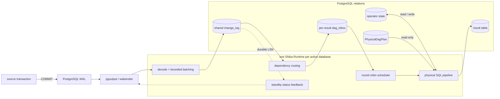

# Shiba

[](https://github.com/frelion/shiba/actions/workflows/ci.yml)
[](https://github.com/frelion/shiba/releases)
[](LICENSE)

Shiba is a PostgreSQL 17 extension for transaction-aware incremental view
maintenance. It consumes committed transactions from `pgoutput`, transforms
their row deltas through a persisted operator DAG, and asynchronously updates
SQL result tables without rescanning registered source tables.

> Status: experimental v0.1. Shiba supports a validated SQL subset and is not
> a distributed execution engine.

## Architecture



The processing unit is a complete source transaction. Ingress normalizes DML
into weighted rows: insert is `+1`, delete is `-1`, and update is
`-1 old / +1 new`. A source transaction is stored once in `change_log`;
`dag_inbox` contains durable per-result references to that shared input.
Large source transactions may be persisted in bounded ingress batches, but
they are not visible to routing or operator apply before the final `Commit`.

The physical pipeline combines the transaction delta with retained operator
state for joins, aggregates, distinct, windows, or TopN. Operator state, result
rows, apply progress, and inbox removal commit atomically for each result
update. Replication feedback advances after durable ingress, independently of
result apply.

The detailed [architecture](docs/ARCHITECTURE.md) documents the stream model,
operator state, scheduling, recovery, and resource bounds.

The [Rust code tour](docs/LEARNING_RUST.md) traces the implementation from
protocol parsers and state machines to PostgreSQL FFI and the Runtime loop.

## Design constraints

- Result maintenance is asynchronous and does not run inside the source
  transaction.
- PostgreSQL owns durable state and set-oriented SQL execution; Rust owns
  protocol decoding, validation, planning, and scheduling.
- Each active database has one Shiba Runtime. PostgreSQL logical decoding uses
  a separate walsender.
- Per-result source-commit order is strict; different results are scheduled
  round-robin.
- A running apply is not preempted. Long applies cause head-of-line blocking
  for the single Runtime.

## Quick start

### Requirements

- PostgreSQL 17 with development headers and `pg_config`;
- Rust toolchain;
- `cargo-pgrx 0.19.1`.

Install the extension from a checkout:

```bash
cargo install cargo-pgrx --version 0.19.1
cargo pgrx init --pg17 /path/to/pg_config
cargo pgrx install --pg-config /path/to/pg_config
```

Configure and restart the target PostgreSQL server:

```conf
session_preload_libraries = 'shiba'
wal_level = logical
max_replication_slots = 4
```

Activate Shiba once per database:

```sql
CREATE EXTENSION shiba;
SELECT shiba.activate();
```

Then declare a streaming table:

```sql
CREATE TABLE public.orders (
  product_id integer NOT NULL,
  amount integer NOT NULL
);

CREATE TABLE shiba.order_stats AS
SELECT product_id,
       count(*) AS order_count,
       sum(amount) AS total_amount
FROM public.orders
GROUP BY product_id;
```

`shiba` is reserved for Shiba-managed result tables. Native PostgreSQL
materialized views keep their normal `REFRESH MATERIALIZED VIEW` behavior.
The complete SQL subset, permissions, and managed-index contract live in
[docs/MVP.md](docs/MVP.md).

## Supported query families

The current MVP supports typed Filter/Project, equality inner and outer joins,
semi/anti joins from `EXISTS` and `IN`, grouped `COUNT`/`SUM`,
`COUNT(DISTINCT)`, `HAVING`, top-level `DISTINCT`, ordered `LIMIT/OFFSET`, and
partitioned windows. The exact contract and rejected SQL shapes are documented
in [docs/MVP.md](docs/MVP.md).

## Development and testing

```bash
cargo fmt -- --check
cargo clippy --all-targets -- -D warnings
./scripts/test-all.sh
```

The complete correctness and performance gates are documented in
[docs/TESTING.md](docs/TESTING.md).

## Releases

Pushing a tag such as `v0.1.0` runs the release workflow. It builds a
PostgreSQL 17 installation package, generates SHA-256 checksums, and publishes
the artifacts to a GitHub Release. The process is described in
[docs/RELEASING.md](docs/RELEASING.md).

## License

Shiba is released under the [PostgreSQL License](LICENSE).
