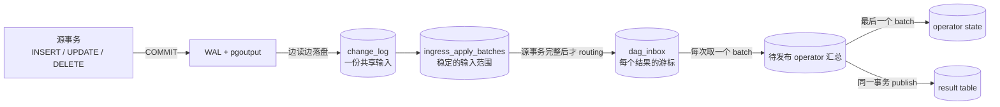
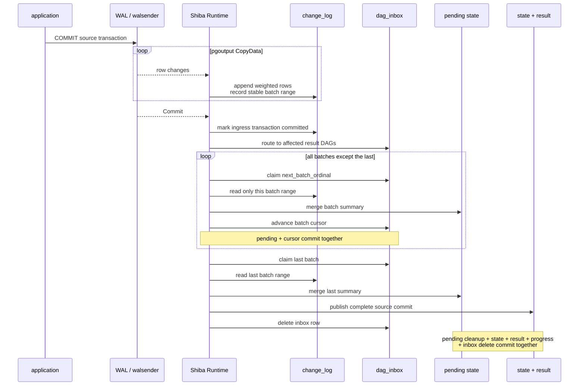

# Shiba 怎么运作

Shiba 是 PostgreSQL 17 扩展。它通过逻辑复制读取已经提交的行变化，把这些变化
增量地应用到结果表。它不在每次更新后重跑注册查询，也不扫描源表来找变化。

先看一笔源事务从提交到结果可见的完整路径：



这里有三个容易混淆的概念：

- `ingress batch`：落盘时形成的一段稳定 `input_seq` 范围；
- prepare apply transaction：某个结果读取一个范围，同时提交待发布汇总和 inbox
  游标，用户仍看不到这笔源事务的变化；
- 最终发布事务：处理最后一个范围，把该结果的正式状态、结果、进度和 inbox
  删除一起提交。

对同一个结果表，`source commit` 是可见性边界：一笔源事务不会只发布一半。如果
同一源事务影响结果 A 和结果 B，Runtime 可以先发布 A、稍后发布 B；Shiba 不保证
多个结果表在同一个 PostgreSQL transaction 中一起可见。

Shiba 确实等到整笔源事务及其 `Commit` 都持久化后，才允许 operator 开始计算。
但它不会把 1000 万行留在 Rust 内存里，也不会在一个 apply transaction 中读取
全部输入。`Commit` 到达前，行变化已经分批写入 `change_log` 并记录为稳定范围；
`Commit` 到达后，Runtime 逐个范围计算。

## 一笔事务的实际时序



### Ingress 期间会不会执行 operator

不会。

每个结果的 DAG 在注册结果表时就已经存在；它是保存的计划和状态，不是进程。对
某笔源事务而言，只有 Runtime 持久化了 pgoutput 的 `Commit`，完成 routing 并
为该结果写入 inbox 后，DAG 才有可调度的工作。此前 Runtime 只把行变化分批落盘，
不执行 operator。

这里的 `ingress_transactions.status = 'open'` 表示 Shiba 尚未读到并持久化这笔
逻辑复制事务的终止记录，不表示应用事务仍在运行。当前使用非 streaming
pgoutput；应用事务提交后，walsender 才会输出它的 `Begin`、row changes 和
`Commit`。

这样做是为了正确处理 abort、savepoint rollback、Runtime 重启和逻辑槽重放。
未提交事务不能影响结果。

### DAG 到底读取多少数据

假设一笔源事务向一张表插入 1000 万条小记录：

| 位置 | 处理量 |
| --- | --- |
| 源表 | 增量阶段读取 0 行，不重扫 |
| pgoutput / Rust | 1000 万条变化都会流过；Rust 只保留当前 ingress batch |
| `change_log` | 共享保存 1000 万条 row image |
| 每个受影响结果 | 累计处理与自己相关的 1000 万条变化；每个 apply transaction 只读一个稳定范围 |
| 最终发布事务 | 读取折叠后的 `K` 个待发布 key/row；`K` 可以是 1，也可以接近 1000 万 |

默认 `ingress_batch_rows` 是 2048，单按行目标估算约 4883 个范围。它是软目标：
完整 CopyData message 或单个 tuple 不拆，所以实际范围可能更大或更小；字节限制
和 socket 暂时无更多数据也会改变范围大小。

共享发生在输入存储层。如果十个结果都依赖这张源表，`change_log` 仍只保存一份
row image，但十个结果会各自推进游标、各自计算与自己相关的范围。

最终 publish 的工作量取决于 operator，而不只取决于输入行数：

| 输入 | pending state 可能有多大 | 最后 publish |
| --- | --- | --- |
| 1000 万行都属于一个 aggregate group | 接近 1 个 group | 更新少量 group |
| 1000 万个不同的 `DISTINCT` key | 接近 1000 万个 key | 超过默认 100 万行配额时暂停；调高后才能继续 |
| TopN 输入产生 1000 万个 retained row | 可能接近 1000 万行 | 超过默认配额时暂停；调高后校验并更新 retained state |
| Join 两侧变化命中大量组合 | 可能产生很大的 join delta | 受 join fan-out 上限约束 |

当前结果表是普通 PostgreSQL 表。最终发布事务虽然可以按 key 分段执行 SQL，但
仍在一个 PostgreSQL transaction 中提交。因此输入读取已经按 batch 拆开，结果
可见性仍对单个结果按 source commit 保持原子；最终发布并不保证常量内存或常量
时间。batch 化降低单次输入读取量，不会消除折叠后状态和 Join fan-out 上限。

## 变更在系统里的表示

逻辑复制行变化被规范成有序 weighted rows：

```text
INSERT row       => (+1, row)
DELETE old       => (-1, old)
UPDATE old → new => (-1, old), (+1, new)
```

一笔事务的输入可以写成：

```text
ΔT = ordered [(source_oid, input_seq, weight, row)]
```

`input_seq` 保留事务内顺序。它用于验证删除和更新不会在任意前缀把
multiplicity 降到负数。batch 之间合并的不只是总和，还包括最小前缀；因此把
一个事务拆成多个 batch 不会改变 retract 校验结果。

`commit_lsn` 只表示源事务的提交顺序。它不是 event-time watermark。Shiba
当前没有 late event、乱序 event-time 或时间窗口 watermark；SQL `Window`
指关系型 window function。

## Operator 如何逐批处理

注册查询会生成持久化的 `LogicalPlan` 和 `PhysicalDagPlan`。注册计划最终只会
选择以下五类固定 operator pipeline：

```text
Aggregate
Distinct
TopN
Window
Join → Aggregate
```

各 pipeline 的 batch 行为如下：

| Pipeline | 每个 batch 做什么 | 最后一个 batch 额外做什么 |
| --- | --- | --- |
| Aggregate | 按 group 折叠 count/sum/min-prefix | 更新 aggregate state 和结果 group |
| `COUNT(DISTINCT)` | 按 group + value 折叠 multiplicity | 更新 distinct state，再更新 aggregate |
| top-level Distinct | 按输出 row 折叠 multiplicity | 处理 `0 ↔ 正数` 边界并更新结果 |
| TopN | 按完整行合并多重集合；相同行可以出现多次 | 更新 retained rows，计算新 TopN |
| Window | 合并 partition + row bag | 重算受影响 partition |
| Join | 合并左右两侧的 row delta | 与旧 arrangement 计算完整 join delta，再 aggregate |

Join 必须等左右两侧属于这笔源事务的 batch 都准备完成，才能计算。这里 `ΔL` /
`ΔR` 是本事务左右输入的变化，`oldL` / `oldR` 是已经发布的左右输入状态
（代码中称 arrangement）：

```text
ΔL × oldR + oldL × ΔR + ΔL × ΔR
```

如果每个 batch 单独直接写 join 结果，跨 batch 的 `ΔL × ΔR` 会漏算。因此 Join
的 batch 阶段只积累左右待发布 row，最后才生成本事务完整的 join delta。

## Runtime 与调度

每个 active database 有一个 `shiba runtime` PostgreSQL background worker。
logical walsender 是 PostgreSQL 的另一个 backend。Shiba 没有 Router 进程、
Executor pool、每 DAG worker 或线程池。

Runtime 主循环做四件事：

```text
ingress → routing → round-robin apply → GC
```

一次 apply transaction 现在是“准备一个 ingress batch”或“处理最后一个 batch
并最终发布”，不是“处理完整的大源事务”。完成一个 batch 后，仍有 backlog 的
DAG 被放回队尾，因此另一个 ready DAG 可以先运行。

每轮还有事务数和时间预算；预算只在 PostgreSQL transaction 之间检查，不会中断
正在执行的 SQL statement。

`DagRuntime` 只是进程内的 plan/program cache entry。它不是线程。cache 使用
有界 LRU，淘汰或重启后从持久 physical plan 重新加载。

## 哪份状态是权威的

| 数据 | 作用 | 是否可重建 |
| --- | --- | --- |
| logical replication slot | 决定 WAL 最早还需要保留到哪里 | PostgreSQL 管理 |
| `ingress_transactions`、`change_log` | 已持久化的源事务和 row delta | slot 重放时按稳定 identity 去重 |
| `ingress_apply_batches` | 每笔源事务固定的 `input_seq` 范围 | 随 ingress transaction 保存 |
| routing cursor、`dag_inbox.next_batch_ordinal` | 哪些结果待处理、处理到哪个 batch | 恢复直接续跑 |
| operator pending tables | 已完成 batch 的事务内汇总 | 最终发布后删除 |
| operator state | 下一笔事务计算所需的正式状态 | 由已发布事务维护 |
| result table | 用户读取的结果 | 与 operator state 同时发布 |
| `view_progress.applied_lsn` | 某个结果最后发布的相关 source commit | 与结果同时推进 |
| `PhysicalDagPlan` | Runtime 要执行的 pipeline | 注册时生成，加载时复验 |

同一源事务只在共享 `change_log` 保存一份 payload。若它影响三个结果，
`dag_inbox` 保存三条引用和三个独立 batch cursor，不复制输入行。

Replication feedback 只确认输入已经持久化，不表示异步结果已经更新。结果进度
必须看每个结果自己的
`view_progress.applied_lsn`。

## 崩溃时会发生什么

关键规则是：待发布汇总和 batch cursor 在同一事务提交；最终发布事务中的
正式 state、result、progress、pending cleanup 和 inbox delete 也在同一事务
提交。

因此：

- ingress batch 落盘前退出：logical slot 从旧 feedback 位置重发；
- ingress batch 落盘后、feedback 前退出：稳定 event identity 去重，不重复追加；
- 某个 prepare batch 中途失败：这个 batch 和游标一起回滚；
- prepare batch 提交后退出：pending 已保存，重启后从下一个 batch 继续；
- 最终发布中途失败：正式 state、result、progress 和 inbox delete 全部回滚；
- routing page 中途失败：cursor 和本页 inbox 写入一起回滚。

短暂锁冲突和 serialization error 会重试。命中明确的资源上限会暂停该结果，
管理员调整配置后可 `shiba.resume()`。确定性的 plan/operator 错误会 quarantine
结果。系统级错误会让 Runtime 退出，由 PostgreSQL 重启。

## 资源上限

| 配置或资源 | 限制的对象 |
| --- | --- |
| `ingress_batch_rows` / `ingress_batch_bytes` | ingress 软目标；完整 CopyData message 或 tuple 不拆 |
| `max_stage_rows` | pending key/row、join fan-out、partition rebuild 等硬上限 |
| `stage_chunk_rows` | 最终发布事务中一条 SQL statement 处理的 folded key 数；不形成新的可见性边界 |
| relation descriptor cache | 到达上限 fail closed |
| DagRuntime cache | 有界 LRU |
| `work_mem` | 每个 PostgreSQL plan node 的内存预算 |
| `temp_file_limit` | Runtime session 的临时文件上限 |

`max_stage_rows` 限制的是折叠后状态或候选工作，不是源事务原始行数。同样是 1000
万条输入，单 group Aggregate 和 1000 万 distinct keys 的资源需求完全不同。

积压也分两层：

- slot 尚未持久化的 WAL lag；
- 已持久化但某个结果尚未 publish 的 `dag_inbox` backlog。

`shiba.progress().pending_wal_bytes` 表示前者，不是某个结果的 inbox backlog。
暂停或 quarantined 的结果会保留 inbox 和共享 changelog 引用。

## 查询注册

`CREATE TABLE shiba... AS SELECT...` 会在一个注册事务中完成：

```text
PostgreSQL analyzed Query
  → 支持范围校验
  → 锁定源表
  → CTAS 初始快照
  → 初始化 operator state
  → 保存 LogicalPlan + PhysicalDagPlan
  → 加入 publication 并安装唤醒 trigger
```

源表锁覆盖初始快照和 activation LSN 的建立，所以快照与随后消费的 WAL 之间没有
写入缺口。Runtime 加载已经编译好的 physical plan，不会为每笔源事务重新规划。

## 代码入口

| 主题 | 文件 |
| --- | --- |
| Runtime 主循环和 round-robin scheduler | `src/worker.rs` |
| replication transport | `src/replication.rs` |
| pgoutput decoder | `src/pgoutput.rs` |
| transaction-aware ingress batching | `src/ingress.rs` |
| ingress 持久化、稳定 batch range | `sql/11_ingress.sql` |
| catalog 和 pending tables | `sql/00_catalog.sql` |
| Aggregate | `sql/21_operator_aggregate.sql` |
| Distinct、TopN、Window | `sql/22_operator_unary_batches.sql` |
| Join | `sql/23_operator_join_batch.sql` |
| claim、batch cursor、最终发布 | `sql/24_operator_dispatch.sql` |
| registration | `sql/30_registration.sql` |

查看某个结果保存的 physical plan：

```sql
SELECT shiba.explain_physical('shiba.sales_by_product');
```

产品支持范围见 [`MVP.md`](MVP.md)，测试入口见 [`TESTING.md`](TESTING.md)，
Rust 代码导读见 [`LEARNING_RUST.md`](LEARNING_RUST.md)。
