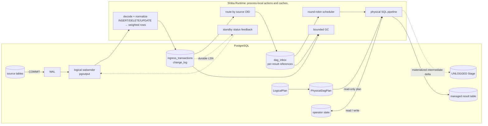
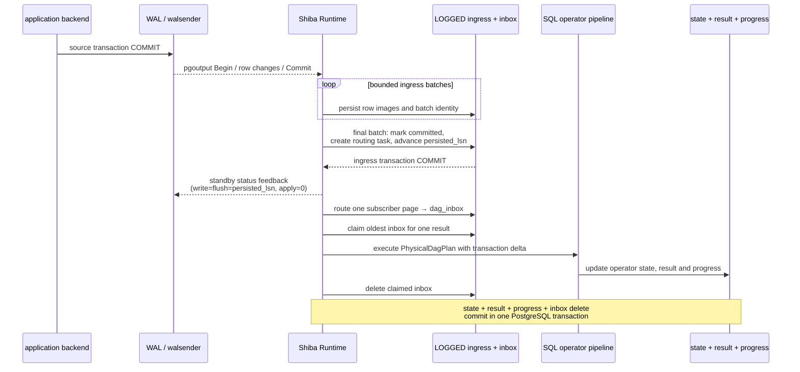
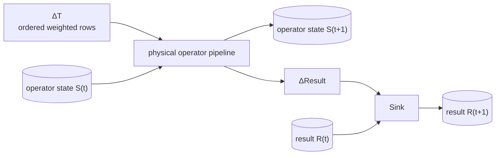

# Shiba 架构

Shiba 是嵌入 PostgreSQL 的增量流处理引擎。它读取逻辑复制产生的已提交变更，
按 source commit 运行持久化的 operator DAG，并异步维护结果表。

完整 source commit 是 apply 单元，不是单行事件。大事务的 ingress 可以拆成
多个有界持久批次，但 final `Commit` 到达前不会进入 routing 或 operator apply。

- 同一源事务内的所有变化一起进入一个结果 DAG；
- 每个结果严格按 `commit_lsn` 处理源事务；
- operator state、result rows、`view_progress` 和该 DAG 的 `dag_inbox` delete
  在一次 apply transaction 中原子提交。

产品支持范围见 [`MVP.md`](MVP.md)，测试与验收见
[`TESTING.md`](TESTING.md)，Rust 代码导读见
[`LEARNING_RUST.md`](LEARNING_RUST.md)。

## 系统拓扑



PostgreSQL 的 logical walsender 和 Shiba Runtime 是两个 backend。Shiba 每个
active database 只有一个 Runtime；没有 Router 进程、Executor pool、每 DAG
worker 或线程池。

图中的 `change_log` 保存一份共享输入。一个源事务若影响多个结果，只增加多条
`dag_inbox` 引用，不复制 row payload。

## 一个源事务的执行时序



Ingress 可以把一个大源事务分成多个持久批次，但这些批次不是结果可见性边界。
只有看到 `Commit` 的 final batch 才会完成 transaction envelope、创建 routing
work 并推进 `persisted_lsn`。

Replication feedback 确认的是 durable ingress，不是 result apply。Shiba 发送
的 standby status 使用 `write = flush = persisted_lsn`、`apply = 0`，因此不会
把异步结果维护错误地报告成 `remote_apply`。

Routing 按 source OID 找到订阅该源且 `activation_lsn < commit_lsn` 的结果，
分页写入 `dag_inbox`。同一结果的 inbox 按 `commit_lsn` 严格处理；不同结果由
Runtime round-robin 调度。

一次 apply 开始后不会被 time-slice。operator state、result rows、
`view_progress` 和 inbox delete 处于同一 PostgreSQL transaction。失败会整体
回滚，不会暴露 source commit 的部分结果。

同一 source commit 若影响多个结果，每个结果在自己的 apply transaction 中
更新。单个结果内部是原子的，多个结果之间不提供共同原子可见性，因此它们的
`applied_lsn` 可以不同。

source trigger 只负责在源事务提交后唤醒 Runtime，不传递 row payload。Apply 的
输入是 `change_log` 和既有 operator state，不读取源表的当前快照。

系统维护三类不同进度：

| 进度 | 含义 |
| --- | --- |
| `persisted_lsn` / replication feedback | 输入已持久化，不能推导结果已更新 |
| `view_progress.applied_lsn` | 单个结果最近应用的相关 source commit；不是连续的全局 WAL watermark |
| `replay_safe_lsn` | 结合真实 slot 位置得到的 GC 安全边界 |

## 流与增量模型

### 事务是微批次

逻辑复制按顺序提供 `Begin`、row change 和 `Commit`。Shiba 将一个已提交源事务
表示为：

```text
ΔT = ordered [(source_oid, sequence, weight, row)]
```

`weight` 表示 row multiplicity 的变化：

```text
INSERT row       => (+1, row)
DELETE old       => (-1, old)
UPDATE old → new => (-1, old), (+1, new)
```

Ingress 的原始权重只有 `-1` 和 `+1`。operator 对相同 key 或 row 折叠后，可以
得到任意整数 multiplicity delta。`sequence` 保留同一事务内的变化顺序，用于
验证删除、更新和其他有序 retract 不会把状态推进到非法值。

PostgreSQL 已经处理 top-level abort、savepoint rollback 和 subtransaction
rollback。Shiba 的 `effective_change_log` 只暴露已提交并完成规范化的行映像。

`commit_lsn` 表示源事务的提交顺序，不是 event-time watermark。Shiba 当前不
处理乱序 event time、late event 或 watermark；SQL `Window` 也是关系上的 SQL
window operator，不是时间窗口系统。

### Operator DAG

注册查询会生成一个持久化的 `LogicalPlan`。当前 grammar 的主要形状是：

```text
single-source aggregate:
Scan → [Filter] → [Distinct] → Aggregate
     → [Having] → Project → Sink

single-source unary:
Scan → [Filter] → Distinct | Window | TopN
     → Project → Sink

join aggregate:
Scan left  → [Filter left]  ┐
                            Join → [post-join Filter] → [Distinct]
Scan right → [Filter right] ┘
     → Aggregate → [Having] → Project → Sink
```

节点集合是封闭的 `OperatorKind` enum。当前 physical runtime 支持五类固定
pipeline：

- Aggregate；
- Join + Aggregate；
- Distinct；
- Window；
- TopN。

这不是通用 DAG interpreter。`PhysicalDagPlan` 记录 source、consumer、fusion
和 materialization 决策，并携带一个经过验证的 execution descriptor。Runtime
根据 descriptor 调用固定的集合化 SQL pipeline。

### 状态与结果增量

一次 DAG apply 的计算关系如下：



不同 operator 保存不同的增量状态：

| Operator | 持久状态 | 增量处理 |
| --- | --- | --- |
| Filter / Project / Having | 无独立状态 | 对 `ΔT` 做谓词和投影 |
| Join | `join_arrangements`：两侧 row bag、join key、multiplicity | 计算 `Δleft × old right`、`old left × Δright` 与 `Δleft × Δright` |
| Aggregate | `aggregate_state`，必要时加 `distinct_state` | 按 key 折叠权重并更新受影响 group |
| Distinct | `projection_state` 中的 row multiplicity | 只在 multiplicity 穿过 `0 ↔ 正数` 时产生结果增量 |
| Window | `window_rows` 中的 partition retained rows | 重算受影响 partition |
| TopN | `topn_rows` 中的 retained multiset | 重排集合并产生 old/new TopN 差异 |
| Sink | result table | 把 `ΔResult` 应用到用户可读结果 |

Filter、Project 等单 consumer stateless 节点可以与 source stage 融合。需要被多个
consumer 复用的 delta 会 materialize。Join input delta 使用
`StatementMaterialized`；Join output `join_delta` 跨 SQL statement 复用，使用
注册时创建的 `Unlogged` Stage。Stage 是 commit-scoped scratch，不是恢复状态。

Physical stage 有三种 storage：

| Storage | 语义 |
| --- | --- |
| `Inline` | 不单独物化，直接供唯一 consumer 使用 |
| `StatementMaterialized` | 在一条 SQL statement 内复用 |
| `Unlogged` | 在同一次 commit program 的多条 statement 之间复用 |

## Runtime 调度

Runtime 主循环位于 `src/worker.rs::shiba_runtime_main`，每轮按以下顺序调用实际
phase：

```text
route_ingress_once
    → ready_dag_oids
    → apply_ready_dags_bounded
    → gc_change_log
    → wait on latch when idle
```

每个 phase 在工作单元之间检查预算：

- routing 每次最多处理一个 subscriber page；
- apply 每轮限制事务数和总调度时间；
- GC 每次删除有限数量的已完成事务；
- idle latch poll 为漏掉的 wakeup 和 `COMMIT PREPARED` 提供恢复路径。

预算不抢占正在执行的 SQL。一次长 apply 会阻塞同一 Runtime 中的 ingress、其他
结果和 GC。这是 single-Runtime 模型的主要吞吐限制。

`DagRuntime` 是 Runtime 内存中的 plan/program cache entry，不是进程。cache
按 LRU 淘汰；被淘汰或重启后从持久 physical plan 重新加载。

## 持久状态与恢复

| 状态 | 存储 | 恢复行为 |
| --- | --- | --- |
| registration metadata、LogicalPlan、PhysicalDagPlan | LOGGED catalog | 保留并复验 |
| ingress transaction、decode batch、`change_log` | LOGGED relation | 保留并按稳定 identity 去重 |
| routing cursor、`dag_inbox` | LOGGED relation | 从未完成位置继续 |
| arrangement、operator state、result、progress | LOGGED relation | 保留 |
| slot `confirmed_flush_lsn` | PostgreSQL logical slot | 作为真实 replay-safe 边界 |
| Stage contents | UNLOGGED relation | 可丢失，在 apply 时重算 |
| parser state、relation cache、DagRuntime cache、latch | Runtime memory | 丢失后重建 |

恢复由三项顺序约束保证：

1. committed transaction envelope、全部 row image 和可恢复的 routing work
   durable 后才发送 feedback；
2. routing complete、无 inbox 引用、retention 到期且 slot 已越过输入后才能 GC；
3. state、result、progress 与 inbox acknowledgement 原子提交。

对应的失败行为：

- ingress commit 前退出：slot 从旧 feedback 位置重发；
- ingress commit 后、feedback 前退出：稳定 event identity 去重；
- routing page 中途失败：cursor 与本页 inbox 同事务回滚；
- apply 中途失败：state、result、progress 与 acknowledgement 同事务回滚；
- Runtime 异常退出：postmaster 存活时按 background-worker restart policy 重启；
- postmaster restart：下一次 source write 或 `shiba.activate()` 重新注册 dynamic
  Runtime。

短暂锁冲突和 serialization error 会重试。显式 commit/Stage 配额超限会暂停该
结果，调整配额后可 `shiba.resume()`。确定性 plan/operator corruption 会
quarantine 该结果，不能 resume；需要修复后 drop 并重新注册。系统或非受控资源
错误会终止 Runtime，由 PostgreSQL 重启。

## 资源边界

| 资源 | 行为 |
| --- | --- |
| ingress batch rows / bytes | 软目标；完整 CopyData message 或 tuple 可以超过 |
| source commit rows / bytes | apply admission 硬上限 |
| Stage rows | fan-out 硬上限 |
| relation descriptor cache | 到达上限时 fail closed，不淘汰 |
| DagRuntime cache | 有界 LRU |
| `work_mem` | Runtime session 设置；每个 PostgreSQL plan node 可分别使用 |
| `temp_file_limit` | Runtime session 临时文件总上限 |

一个完整 source commit 的 DAG apply 仍是不可拆的原子单元。Shiba 当前不支持把
同一 source commit 分成多个部分可见的 result transaction，因此 backend RSS
不是严格常数，长 apply 也不能由调度预算中断。

积压分为两层：slot 尚未持久化的 WAL lag，以及已经路由但尚未 apply 的
per-result inbox backlog。`shiba.progress().pending_wal_bytes` 表示前者，不是
某个结果的 inbox backlog。暂停或 quarantined 的结果会保留 inbox 和对应的
shared changelog；复制 slot 同时继续约束 WAL 与 changelog 的回收边界。

## 查询注册

`CREATE TABLE shiba... AS SELECT...` 同时建立初始快照和后续增量程序：

```text
PostgreSQL analyzed Query
    → Shiba owned query model
    → supported-shape validation
    → lock source tables
    → PostgreSQL CTAS backfill
    → registration metadata + operator state
    → LogicalPlan + PhysicalDagPlan
    → publication membership + source triggers
```

`src/query_tree.rs` 是 PostgreSQL Query pointer 的 unsafe adapter。查询语义的
识别基于 PostgreSQL 已分析、已类型化的 Query tree，而不是 Shiba 自行解析 SQL
文本。

源表锁覆盖 CTAS backfill、activation LSN、metadata、plan、state、publication
membership 和 trigger 安装。锁在注册事务提交后释放，因此初始快照与随后消费
的 WAL 增量之间没有写入缺口。

计划只在注册时编译。Runtime 启动或重启时加载并复验
`PhysicalDagPlan`，不会为每个 source commit 重新规划。

## 代码入口

| 主题 | 文件 |
| --- | --- |
| extension wiring 与 `_PG_init` | `src/lib.rs` |
| CTAS hook | `src/ddl.rs` |
| PostgreSQL Query adapter | `src/query_tree.rs` |
| owned query validation | `src/query_analysis.rs` |
| logical / physical plan | `src/logical/` |
| replication transport | `src/replication.rs` |
| pgoutput decoder | `src/pgoutput.rs` |
| transaction-aware ingress state machine | `src/ingress.rs` |
| Runtime scheduling and apply loop | `src/worker.rs` |
| ingress、routing、feedback 与 GC | `sql/10_runtime.sql`, `sql/11_ingress.sql` |
| operator kernels | `sql/20_operator_filters.sql` 到 `sql/24_operator_dispatch.sql` |
| physical Stage | `sql/26_physical_stages.sql` |
| registration | `sql/30_registration.sql` |
| lifecycle | `sql/40_lifecycle.sql` |

查看一个结果的持久化 physical plan：

```sql
SELECT shiba.explain_physical('shiba.sales_by_product');
```
