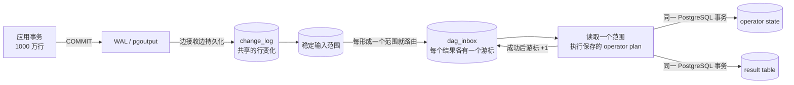
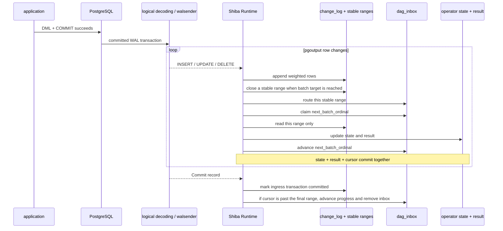

# Shiba 怎么运作

Shiba 从 PostgreSQL 的逻辑复制流读取已经提交的行变化，再把变化增量地写进结果表。
源表有新写入时，它不会重新扫描源表，也不会重新执行整条查询。

先看一笔大事务。假设应用一次插入 1000 万行：



这张图里最重要的是两件事：

1. 当前关闭 pgoutput transaction streaming，所以回滚的源事务不会进入 Shiba
   ingress。walsender 发出 `Begin` 和行变化时，源事务其实已经提交；末尾的
   pgoutput `Commit` 只是 Shiba 尚未读到的结束记录，不是源事务仍未提交。
2. Runtime 每持久化一个稳定范围，就可以路由并运行这个范围，不等末尾
   `Commit`。operator state、结果表和 batch 游标在同一个 PostgreSQL 事务里提交。
   `Commit` 只把 batch 列表标为完整；此后确认游标已经越过最后一个范围，才推进
   progress、删除 inbox 并允许复制 feedback 前进。

因此，对同一个结果表，源事务不再是原子可见边界。一笔 1000 万行的源事务会逐批
出现在结果里。处理到一半时，用户可能看到前 500 万行产生的结果；这个中间结果
不一定对应源表的任何一个事务快照。

## 数据按什么顺序流动



`ingress_batch_rows` 和 `ingress_batch_bytes` 是 ingress 的软目标。完整的 CopyData
message 或单个 tuple 不会被切开，所以实际范围不保证正好等于配置值。范围一旦
写入 `ingress_apply_batches` 就不再变化，所有结果 DAG 都用同一组范围，但各自
保存自己的消费游标。

Shiba 当前使用非 streaming pgoutput。应用事务提交后，walsender 才输出它的
`Begin`、行变化和 `Commit`。因此 Runtime 收到 `Begin` 时已经知道稳定的
`final_lsn`，可以把随后形成的每个范围直接交给 DAG。若 DAG 已消费当前全部范围、
但 Runtime 还没读到 `Commit`，inbox 保留在原处等待；它不会推进 progress，也
不会被删除。这里没有未提交的源数据进入结果。

一个 ingress batch 形成一个共享稳定范围；某个结果消费这个范围称为一个 DAG
batch；提交这个 DAG batch 的 PostgreSQL 事务称为 apply 事务。

## 一批数据如何变成结果

逻辑复制的 DML 先被规范成有顺序的 weighted rows：

```text
INSERT row       => (+1, row)
DELETE old       => (-1, old)
UPDATE old → new => (-1, old), (+1, new)
```

`input_seq` 保存源事务内的顺序。每个 DAG batch 对应一个固定的 `input_seq`
范围。Runtime 加载注册时生成的 `PhysicalDagPlan`，只读取这个范围中与该 DAG
有关的变化。

```text
一个 DAG batch 的 PostgreSQL transaction

read input_seq [first, last]
  → fold this batch
  → verify that row counts cannot become negative
  → update authoritative operator state
  → update result table
  → advance dag_inbox.next_batch_ordinal
```

折叠使用共享的 UNLOGGED scratch 表。apply 协议要求其中的 rows 只属于当前
batch，并在 batch 之间保持为空；PostgreSQL 不会自动清空这些表。它们只帮助同一
个 batch 里的多条 SQL 交换中间数据。崩溃恢复不依赖 scratch；恢复依赖持久化的
`change_log`、稳定输入范围、正式 operator state、结果表和 inbox 游标。失败的
batch 会根据游标重新读取同一个输入范围。

当前注册计划只会生成五类 pipeline：

| Pipeline | 每个 ingress batch 的工作 |
| --- | --- |
| Aggregate | 按 group 折叠 delta，更新 aggregate state 和可见 group；`COUNT(DISTINCT)` 还会维护 `(group, value)` multiplicity |
| top-level Distinct | 更新输出 row 的 multiplicity，只在 `0 ↔ 正数` 时插入或删除结果 |
| TopN | 更新 retained row bag，再从当前 state 计算结果 |
| Window | 更新 row bag，再计算这个 batch 影响的 partition |
| Join → Aggregate | 用当前左右 arrangement 计算本 batch 的 join delta，再更新 arrangement 和 aggregate |

### Join 为什么可以逐批

设当前 batch 的左右变化是 `ΔL` 和 `ΔR`，batch 开始前的正式 arrangement 是
`L` 和 `R`。inner join 的匹配部分是：

```text
ΔL × R + L × ΔR + ΔL × ΔR
```

outer、semi、anti 和 null-aware anti 还会根据匹配数的 `0 ↔ 正数` 变化补上
NULL-extension 或存在性边界。代码把匹配部分和这些边界一起写成这一批精确的
`F(new) - F(old)`。

这一批提交后，正式 arrangement 变成 `L + ΔL` 和 `R + ΔR`。下一批用这个新
状态继续计算。因此跨 batch 的组合不会丢失：早一批的变化已经进入 arrangement，
晚一批到来时会与它匹配。所有批次相加就是整笔源事务的最终变化。

这和旧的“攒完整笔 source transaction，最后统一发布”不同。现在每批的 Join
变化会直接进入结果。

## 1000 万行到底会读多少

如果一笔 source transaction 插入 1000 万行：

| 位置 | 实际工作 |
| --- | --- |
| 源表 | 增量维护阶段不扫描 |
| pgoutput / Rust | 1000 万条变化都会经过；Rust 只保留当前 ingress batch |
| `change_log` | 一份共享输入，共保存 1000 万条 row image |
| 每个受影响的 DAG | 最终仍要处理与自己相关的全部变化，但一次 transaction 只读一个稳定范围 |
| 用户可见结果 | 每个成功 batch 都会推进，不等待第 1000 万行处理完成 |

默认按 `ingress_batch_rows = 2048` 粗略估算，1000 万行约有 4883 个范围。十个
结果依赖同一张源表时，输入 payload 仍只保存一份；十个 DAG 会独立读取相关范围
并维护自己的 state、result 和 cursor。

batch 解决的是“大 source commit 导致一个巨大 apply transaction”的问题。它
不能减少查询本身必须完成的总工作，也没有解决单个输入产生海量输出的问题：

- 一个 Join row 匹配一百万行，结果就至少有一百万份工作；
- 一个 Window batch 命中超大 partition，当前实现仍可能重算整个 partition；
- TopN retained state 或 DISTINCT key 数很大时，单条 operator SQL 仍可能很重。

## Runtime 和调度

每个 active database 只有一个名为 `shiba runtime` 的 PostgreSQL background
worker。logical walsender 是 PostgreSQL 自己的另一个 backend。Shiba 没有
Router 进程、Executor pool、每 DAG worker 或 Rust 线程池。

Runtime 主循环是：

```text
ingress one batch → routing one page → round-robin apply → GC
```

一次 apply 只处理一个 DAG 的一个 ingress batch。有后续 batch 的 DAG 会回到
队尾，因此其他 ready DAG 可以先执行。每轮的事务数和时间预算只在 PostgreSQL
transaction 之间检查；已经运行的 SQL statement 不会被中断。

`DagRuntime` 是内存中已加载的执行计划，不是线程。cache 是有界 LRU；被淘汰或
Runtime 重启后，会从持久化的 physical plan 重新加载。

同一 DAG 严格按 source commit 和 batch ordinal 顺序推进。不同 DAG 独立调度，
所以同一 source transaction 对结果 A 的前几批可能已经可见，而结果 B 尚未开始。

## 哪些状态决定恢复位置

| 数据 | 作用 |
| --- | --- |
| logical replication slot | 决定 PostgreSQL 还要保留哪些 WAL |
| `ingress_transactions`、`change_log` | 已持久化的 source transaction 和 ordered row delta |
| `ingress_apply_batches` | 不再变化的 `input_seq` 范围 |
| 每批 routing cursor | 这个稳定范围的结果订阅者路由到哪里 |
| `dag_inbox.next_batch_ordinal` | 该结果下一批应该读哪个范围 |
| operator state | 下一批计算使用的正式状态 |
| result table | 用户当前看到的结果，包括已提交的部分 source transaction |
| `view_progress.applied_lsn` | 最后一笔已经全部消费完成的相关 source commit |
| `PhysicalDagPlan` | Runtime 要运行的 pipeline |

`dag_inbox.next_batch_ordinal` 是处理大 source commit 时的精确恢复位置。
`view_progress.applied_lsn` 只在 pgoutput `Commit` 已持久化、batch 列表完整且
游标越过最后一个 batch 时推进。因此，当一笔 source transaction 处理到一半时，
结果表已经变化，`view_progress` 仍指向上一笔完整处理完的 source commit。它不是
“当前结果精确对应哪个源快照”的证明。

Replication feedback 只确认输入已经持久化，也不表示所有结果已经追上。

## 崩溃和重试

每个 batch 都遵守同一条规则：正式 state、result mutation 和 batch cursor 必须
在同一个 PostgreSQL transaction 中提交。

- batch 提交前 Runtime 退出：本批 state、result 和 cursor 一起回滚，重启后重做；
- batch 提交后 Runtime 退出：本批结果保持可见，重启后从下一 ordinal 继续；
- `Commit` 到达前退出：已提交的批次保留，当前批次按事务回滚或提交；重放靠稳定
  event identity 和 batch ordinal 去重，不会重复应用；
- 最后一批失败：最后一批 state、result、`view_progress` 和 inbox 删除一起回滚；
- ingress 落盘后、replication feedback 前退出：稳定 event identity 去重；
- routing page 中途失败：本页 inbox 写入和 routing cursor 一起回滚。

所以 crash replay 不会把一个已经提交的 batch 重算两次。但放弃 source-commit
原子可见后，如果后续 batch 持续失败，用户会长期看到这笔 source transaction
已经成功处理的前缀。短暂锁冲突和 serialization error 会重试；确定性错误会暂停
或 quarantine 当前 DAG，其他 DAG 继续工作。

## 资源上限

| 配置或资源 | 当前限制的对象 |
| --- | --- |
| `ingress_batch_rows` / `ingress_batch_bytes` | ingress batch 的软目标 |
| `max_stage_rows` | Aggregate/Distinct 的本批 scratch；Join candidates；TopN retained state；Window 受影响的完整 partition |
| `stage_chunk_rows` | Aggregate/Distinct 在一个 apply 事务内，一条 state/sink SQL 处理的 folded keys |
| relation descriptor cache | 到达上限后 fail closed |
| DagRuntime cache | 有界 LRU |
| `work_mem` | 每个 PostgreSQL plan node 的内存预算 |
| `temp_file_limit` | Runtime session 的临时文件上限 |

当前源事务不再需要一次性通过一个 transaction-size admission gate。但
`max_stage_rows` 仍是硬上限。更小的 ingress batch 能减少本批输入和 scratch，
但不能缩小已有 TopN state、受影响的完整 Window partition，或一行变化产生的
Join fanout。超过上限时 DAG 仍会暂停。

积压有两处：

- slot 尚未被持久化的 WAL lag；
- 已经持久化、但某个 DAG 尚未处理完的 `dag_inbox` backlog。

`shiba.progress().pending_wal_bytes` 表示前者，不是某个结果的 inbox backlog。
暂停或 quarantined 的结果会保留 inbox 和共享 changelog 引用。

## 查询注册

`CREATE TABLE shiba... AS SELECT...` 在一个注册事务中完成：

```text
PostgreSQL analyzed Query
  → 支持范围校验
  → 锁定源表
  → CTAS 初始快照
  → 初始化 operator state
  → 保存 LogicalPlan + PhysicalDagPlan
  → 加入 publication 并安装唤醒 trigger
```

源表锁覆盖初始快照和 activation LSN 的建立，所以快照与随后消费的 WAL 之间没有
写入缺口。Runtime 为每笔 source transaction 运行已保存的 physical plan，不会
重新规划查询。

## 代码入口

| 主题 | 文件 |
| --- | --- |
| Runtime 主循环和 round-robin scheduler | `src/worker.rs` |
| replication transport | `src/replication.rs` |
| pgoutput decoder | `src/pgoutput.rs` |
| transaction-aware ingress batching | `src/ingress.rs` |
| ingress 持久化、稳定 batch range | `sql/11_ingress.sql` |
| catalog 和 scratch/state tables | `sql/00_catalog.sql` |
| Aggregate | `sql/21_operator_aggregate.sql` |
| Distinct、TopN、Window | `sql/22_operator_unary_batches.sql` |
| Join | `sql/23_operator_join_batch.sql` |
| claim、batch cursor、progress/ack | `sql/24_operator_dispatch.sql` |
| registration | `sql/30_registration.sql` |

查看某个结果保存的 physical plan：

```sql
SELECT shiba.explain_physical('shiba.sales_by_product');
```

产品支持范围见 [`MVP.md`](MVP.md)，测试入口见 [`TESTING.md`](TESTING.md)，
Rust 代码导读见 [`LEARNING_RUST.md`](LEARNING_RUST.md)。
