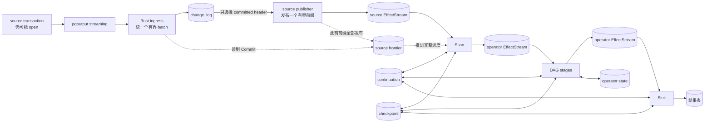
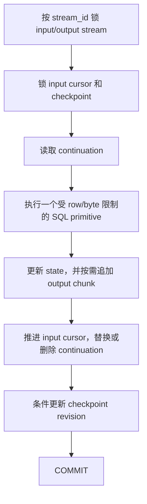
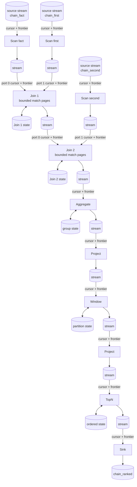
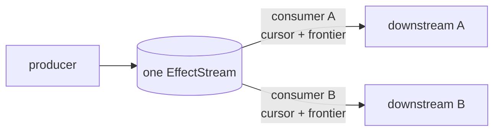
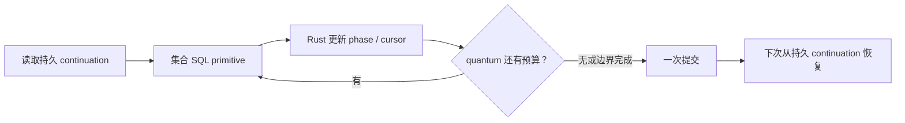
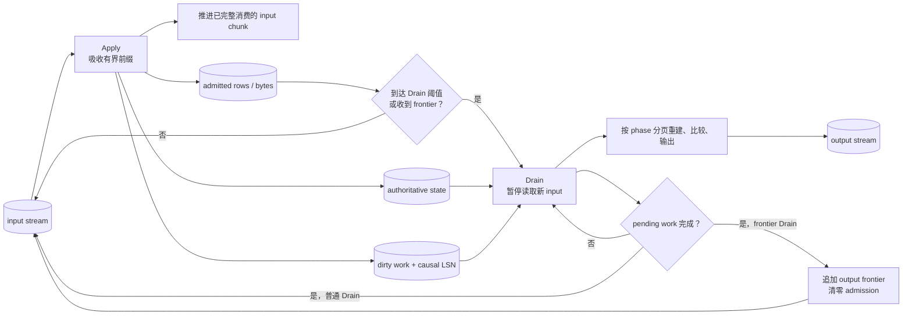
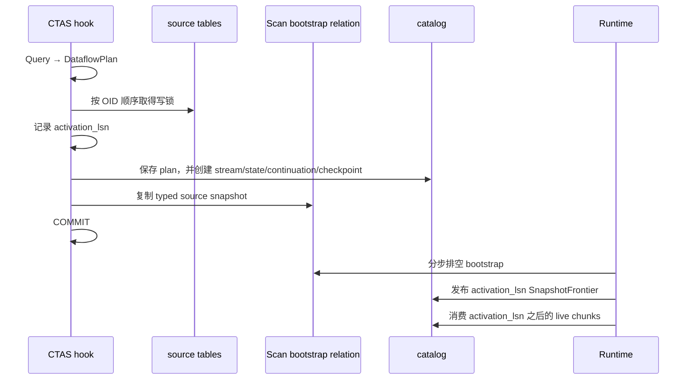

# Shiba 是怎么运行的

Shiba 把一条 `SELECT` 注册成持续运行的 DAG。源表变化从 PostgreSQL WAL 进入
DAG，最后由 Sink 修改结果表。读取结果表时不会重新执行原查询。

## 完整数据路径



图中的名词只表示下面这些东西：

| 名词 | 含义 |
| --- | --- |
| weighted row | 一条完整行及其权重；插入是 `+1`，删除是 `-1` |
| EffectStream | producer 按顺序追加的持久 typed chunks；下游从自己的位置读取 |
| input cursor | 某个 stage 的某个 input port 下一次从哪个 chunk、哪一行开始 |
| frontier | “这个 source LSN 及以前不会再有新数据”的完整进度，不是数据 batch |
| continuation | 当前 phase，以及下一行或下一页从哪里继续 |
| admission | 有状态算子自上次 output frontier 起已吸收的输入 row/byte 数 |
| checkpoint | step revision、是否有 continuation，以及 admission 计数 |
| operator state | Join arrangement、Aggregate group、Window partition 等持久计算状态 |

这些状态都在 PostgreSQL relation 中。Rust 内存里的 plan cache 和公平轮转游标
可以丢弃；它们不是恢复依据。

还需要区分三种语义：

| 边界 | Shiba 保证什么 |
| --- | --- |
| source transaction | open 时只暂存；Commit 后各 batch 可独立进入 DAG，不保证整笔事务同时出现在结果表 |
| operator step | state、cursor、continuation、output 和 checkpoint 中本 step 改动的部分在一个 PostgreSQL transaction 中提交；这是内部恢复单位 |
| Sink step | 一个有界结果前缀的 DML 与对应 input cursor、continuation、checkpoint 同时提交；这是用户可见的 exactly-once 边界 |

所以，一笔 1000 万行的 source transaction 会分批进入结果表。用户可能先看到它
已经提交到 Sink 的前缀，不会等到 1000 万行全部完成后一次出现。

## 一次 INSERT 如何到达结果表

假设应用执行：

```sql
INSERT INTO public.orders
SELECT ...
FROM generate_series(1, 10000000);
COMMIT;
```

Shiba 使用 pgoutput protocol v2，并设置 `streaming 'on'`。大事务尚未提交时，
walsender 就可以发送多个 `StreamStart ... StreamStop` 段；最后发送
`StreamCommit` 或 `StreamAbort`。

### 1. ingress 保存一个 batch

[`src/ingress.rs`](../src/ingress.rs) 按
`shiba.batch_rows` 和 `shiba.batch_bytes` 读取一个 batch，并把
DML 转成 weighted rows：

```text
INSERT row       => (+1, row)
DELETE old       => (-1, old)
UPDATE old → new => (-1, old), (+1, new)
```

[`persist_ingress_batch`](../src/worker.rs) 调用 Rust 的
[`admission`](../src/admission.rs) 协议，在一个短 PostgreSQL transaction 中原子写入
source transaction header、`change_log`、publication cursor 和 batch 计数。header
用首次 `Begin/StreamStart` 的 WAL 位置标识，不能只用会复用的 xid。这个 transaction
失败时全部回滚，logical replication slot 会保留尚未确认的 WAL。

如果 1000 万行超过 batch 目标，`ReplicationIngress::poll_batch` 会在仍未读到
pgoutput `Commit` 时返回。下一批以后再读；不需要把整笔 source transaction 放进
一个 Rust 对象或一个 PostgreSQL transaction。

open transaction 的 batch 对 DAG 不可见。每条变更还记录当前 subxid：
`StreamAbort(xid, subxid)` 只标记并跳过对应子事务；顶层 Abort 把 header 封存为
`aborted`，不在复制热路径执行一次无界删除。只有 Commit 消息带有可安全确认的
`end_lsn`；Abort 不推进 replication feedback，而是等待后续 Commit 带着位置前进。
因此崩溃后可能重放已记录的 Abort，但不会从 StreamAbort 中间开始。

### 2. publisher 追加一个 source chunk

Runtime 总是先处理已经持久化的 publication work。
Rust 的 [`publication`](../src/publication.rs) 协议从 `change_log` 读取一个受
row/byte 限制的前缀，写入 source stream 的 typed payload relation，再追加对应的
chunk metadata。payload、metadata 和 publication cursor 在同一个 transaction
提交。

publisher 只选择 `committed` header。`Commit` 封口后，各个已暂存 batch 可以依次
变成 source chunk；不需要等同一 source transaction 的所有 batch 一起发布。这样
既不会把最终 Abort 的数据送进 DAG，也不会恢复 source-commit 级原子可见性。

source frontier 的条件更严格。它按已经出现的 Commit/Abort LSN 排序；只有最早的
sealed transaction 完成全部 publication work 后才能推进。open transaction
尚未产生终止 WAL 位置，因此不会阻塞已有的 Commit/Abort。

### 3. DAG 一次运行一个 stage step

source chunk 提交后，订阅它的 Scan 变为 runnable。Runtime 不会从 Scan 递归调用
整条 DAG；它从持久 cursor、continuation 和 stream capacity 判断哪些 stage
可运行，一次选择一个 stage。

每个 step 都遵循同一套提交过程：



[`KernelRunner`](../src/execution/runner.rs) 是唯一的 step 生命周期入口。每个算子先
声明物理 input 和 output contract；Runner 创建
[`StepContext`](../src/execution/step.rs)、执行公共锁与 backpressure 检查，再调用算子
的一个有界 `step`。算子只能返回 `StepReceipt`，不能自行提交 checkpoint。
Runner 最后发布 pending output 并条件更新 checkpoint revision。

`operator_checkpoints.revision` 是 step commit 的 CAS guard 和递增序列；
`has_continuation` 是 continuation 是否存在的权威 bit；typed continuation row
保存权威的 phase 和恢复 cursor。`StepContext` 读取时要求 presence bit 与 row
是否存在一致。公共 replacement 会对旧 typed fields 做 CAS，并在 context 中记录
新的 presence；transition 和最终 commit 再次校验它。三者各管一层，不会分叉。

因此新增算子只增加四样东西：`OperatorSpec`、自己的 typed state/continuation、
一个 `step` 算法和 dispatcher 中的一条注册。它不能另建 transaction、checkpoint
或 outcome 协议。Rust 算法决定 phase 和恢复位置；PostgreSQL 只执行 bounded typed
集合运算。

一个 stage 追加 output chunk 后，它的下游会在本轮或后续 Runtime 轮次变为
runnable。一个 step 没完成当前页时会保存 continuation；重启后读取同一条
continuation 继续。普通 Scan、Filter、Project 只读取当前 chunk 的有界前缀；
有状态算子还会读取自己的持久 state，但不会重新扫描 source table。

### 4. Sink 提交结果前缀

Sink 消费最后一条 EffectStream 的 weighted rows，并把一个受预算限制的前缀
应用到结果表。结果 DML、Sink input cursor、continuation 和 checkpoint 在同一个
PostgreSQL transaction 中提交。

如果 Runtime 在提交前退出，这些改动一起回滚；如果在提交后退出，cursor 已经
越过对应结果 effect，恢复时不会重复应用。这是 Shiba 对用户可见结果的
exactly-once 单位，不是整笔 source transaction。

## 复杂 SQL 如何变成 DAG

PostgreSQL 完成语法分析和名称解析后，
[`src/planner/lowering.rs`](../src/planner/lowering.rs) 把 `Query` 转成唯一的
`DataflowPlan`。例如下面这条查询包含三个 source、两个 Join、Aggregate、Window
和 TopN：

```sql
CREATE TABLE shiba.chain_ranked AS
SELECT first_key,
       joined_rows,
       row_number() OVER (
         ORDER BY joined_rows DESC, first_key
       ) AS rank
FROM (
  SELECT fact.first_key,
         count(*) AS joined_rows
  FROM public.chain_fact AS fact
  JOIN public.chain_first AS first_side
    ON first_side.first_key = fact.first_key
  JOIN public.chain_second AS second_side
    ON second_side.second_key = first_side.second_key
  GROUP BY fact.first_key
) AS grouped
ORDER BY joined_rows DESC, first_key
LIMIT 100;
```

它的主要 stage 和 stream 如下。Project 也画出来，因为它们是实际 stage，不是
图中的省略步骤。



两个 Join 都是 fan-in：每个 input port 有独立 cursor，不要求两边凑成同一个
batch。任一输入有数据时 Join 都可以工作；只有所有输入都证明某个 LSN 已经完整，
它才能向下游推进该 frontier。

两个 Join 也可能产生 row fanout。一条输入匹配很多 arrangement rows 时，Join
只扫描一个有界 keyset page、追加一个 output chunk，并在 continuation 中保存
当前 input row、input port 和 opposite-side cursor。第二个 Join 可以在第一个
Join 仍继续分页时消费已经提交的 chunks。

`DataflowPlan` 只保存通用 operator 及其 typed schema、input bindings 和配置：

```text
Scan Filter Project Join Distinct Aggregate Window TopN Sink
```

复杂查询靠这些 operator 组合，不会选择某个固定 query family，也没有第二套
physical plan 或 PL/pgSQL fallback。完整 SQL 支持范围见
[`SQL.md`](SQL.md)。

## EffectStream、fanout 和背压

除 Sink 外，每个 stage 只有一条 output EffectStream。每个下游 input port 在
`effect_stream_consumers` 中保存自己的 cursor；多个 consumer 共享 payload：



这就是 stream fanout。增加下游只增加 consumer cursor，不复制已经存储的
payload。GC 只能删除所有 consumer 都越过的 chunk。

EffectStream 的持久数据分为：

```text
effect_streams
  next sequence、retained rows/bytes/chunks、frontier、backpressure

effect_stream_chunks
  data/frontier chunk metadata

generated payload relation
  (stream_id, chunk_seq, row_ordinal, weight, row_value)

effect_stream_consumers
  每个 input port 的 next_chunk_seq、activation_lsn、consumed_frontier_lsn
```

operator stream 中，data chunk 保存 weighted rows，frontier chunk 不保存行。
source stream 只保存 data chunks；它的 generation-wide frontier 来自
`ingress_replay_state.published_lsn`，由 Scan 转成下游的 frontier chunk。
chunk sequence 回答“读到 stream 的哪里”，frontier 回答“处理完整到哪个 source
LSN”，两者不能替代。

stream 同时统计 retained chunk、row 和 byte。达到任一 high watermark 后，
producer 在写入前返回 blocked；所有 consumer 推进、GC 降到 low watermark 后才
解除。下游慢时，背压会从最后一条 stream 逐级阻止上游继续产生数据。Runtime
仍会调度可以消费现有 chunks 的下游 stage，让 GC 有机会释放容量。

如果 source publication 被背压，Runtime 暂停读取新 WAL，只保留当前有界 ingress
staging。复制连接仍定期发送 standby status，并且只确认已经持久化的 ingress
LSN；重复 heartbeat 不会重写同一个 replay-state row。

## 大数据量如何保持可恢复

如果 1000 万行都影响查询，总工作量不能消失：相关 Scan 最终都要处理这些变化。
区别是每层都有自己的持久切分点：

| 层 | 配置 |
| --- | --- |
| ingress 读取 batch | `shiba.batch_rows`, `shiba.batch_bytes` |
| source publication chunk | 复用 ingress row/byte 目标，但按 source stream 独立切分 |
| operator transaction quantum | `shiba.batch_rows`, `shiba.batch_bytes` |
| Aggregate/Window/TopN Drain 调度 | 从 batch 预算推导 |

一个 ingress batch 不对应一个 source chunk，也不对应一个 operator transaction。
每层按自己的预算提交和恢复。ingress 在完整 pgoutput message 之后检查目标，因此
一条 message（包括 UPDATE 的 `-old,+new`）可以越过 ingress row/byte target；
operator quantum 的 row target 则是硬边界。

operator 的 `phase` 不是 transaction 边界。Rust 可以在一个 transaction 中连续
执行 open、preflight、probe、finalize 等转换；所有转换共享同一份 input/output
row/byte 预算。任一维度耗尽、输入 chunk 完成、遇到 frontier 或需要让出调度时，
才提交 state、continuation、input cursor、output 和 checkpoint。



Join 在 transaction 内先把输出行写到尚未发布的 typed payload chunk，结束时才
一次发布对应的不可变 chunk metadata。外部看不到半个 chunk；崩溃会让 payload、
arrangement、continuation 和 checkpoint 一起回滚。这样 phase 数量不会直接变成
transaction 数量，也不会为每个小匹配页制造一个 chunk。

普通 Scan、Filter、Project 读取当前 chunk 的有界前缀。Join 记录当前 input row 和
匹配页 cursor。Aggregate 记录 dirty group 和 rebuild cursor；Window 记录
partition、frame、function phase 和 cursor；TopN 记录重建和 output diff cursor。
它们都从持久位置继续，不会为一次增量重读完整 source table。

单个不可再拆的 typed work item，例如一条 input row 或一次 Window finalization，
可以超过 byte target 并单独占一个 quantum；其余工作必须在达到 row/byte target 时
保存 continuation。Runtime 还为 PostgreSQL statement 设置 `work_mem` 和
`temp_file_limit`，但正在执行的 SQL statement 不会被 wall-clock timer 中断，
所以 kernel 自己的分页条件才是 transaction 边界。

### Aggregate、Window、TopN 的 Apply 和 Drain

如果高 fanout Join 连续产生很多小 chunks，Aggregate、Window 或 TopN 每收到一个
chunk 就完整重建输出，会反复扫描相同 state。它们把输入吸收和输出重建分开：



Apply 每次仍受 stage row/byte budget 限制。完整 input chunk 被吸收后可以立即推进
cursor；后续 Drain 依赖 operator state 和 pending work，不再固定已经消费的
chunk。若预算在 chunk 中间耗尽，partial input cursor 保存在 continuation。

admission 阈值从配置值 `Q` 开始，按 `Q, 2Q, 4Q, ...` 增长，到固定间隔上限后
继续按该间隔触发。普通 Drain 完成后保留累计计数；只有 output frontier 与计数
清零在同一个 transaction 中提交。这样不会因每个小 fanout chunk 都重建 hot
group，同时两轮 Drain 之间的新输入仍有上限。

Drain 自身也按 phase 和 cursor 分页。Aggregate 分页处理 dirty groups 和 aggregate
state；Window 分页处理 partition、frame、function 和 output difference；TopN
分页处理 ordered state 和 result difference。每次提交都留下准确的下一恢复位置。

Window aggregate Fold 可以在一个 step 内连续处理多个 output ordinals。预算累计
frame input 的 rows/bytes；每次 finalization 另计一个 row，并计入 materialized
function/candidate 的 bytes。accumulator 已完成、但 finalization 放不进剩余预算时，
continuation 持久保存 `ready_to_finalize`，下一 step 再执行。frame relation 缺行是
持久状态错误，不会被当成空 frame；即使所有 frame 确实为空，一个 step 也最多访问
64 个 ordinals。

Distinct 不使用这套 admission 调度。它更新 SQL-equal group 的 multiplicity；
如果当前代表行改变，就先把 `-old` retraction、再把 `+new` insertion 写入持久
effect queue。Drain 在读取后续 input 或转发 frontier 前按 output budget 清空这条
queue。

## 初始数据如何进入 DAG

注册 CTAS 时，Shiba 必须覆盖 source snapshot 和注册后 WAL 之间的边界：



source lock 覆盖 snapshot 和 activation LSN 的建立，因此不会漏掉中间写入。
bootstrap rows 通过正常的 Scan → DAG → Sink 路径处理。Scan 排空 snapshot 后
先发布恰好位于 `activation_lsn` 的 SnapshotFrontier，再进入 live phase。

当前限制是 source snapshot 仍在注册 transaction 中复制进 bootstrap relation。
后续处理有界，但在已有超大 source table 上注册 CTAS 仍可能产生长 transaction。

## Runtime 和崩溃恢复

每个 active database 有一个 Shiba background worker。logical walsender 是
PostgreSQL 的另一个 backend，不是第二个 Shiba Runtime。

[`shiba_runtime_main`](../src/worker.rs) 的循环是：

```text
发布一个 pending source prefix
如果没有 pending publication，读取一个 ingress batch
运行一轮有界的 ready operator steps
定期 GC change_log 和 EffectStream
```

一轮可以运行多个 stage steps，但每次只提交一个 stage。Runtime 没有内存 ready
queue；同一条数据库谓词从 checkpoint、consumer cursor、continuation 和 stream
capacity 选择 runnable result 和 stage。cache 淘汰或 Runtime 重启后仍执行这条查询。

恢复位置按职责分布：

| 内容 | 权威位置 |
| --- | --- |
| 尚未确认的 WAL | logical replication slot |
| ingress LSN、source transaction、ordered effects、publication cursor | `ingress_replay_state`, `ingress_transactions`, `change_log`, `source_publications` |
| 查询计划 | `dataflows.plan` |
| stream chunks、payload、每个 input cursor | EffectStream catalog 和 generated payload relation |
| step revision、admission、continuation presence authority | `operator_checkpoints` |
| operator phase、下一页 cursor | generated continuation relation |
| Join/Aggregate/Window/TopN 等计算状态 | generated typed state relations |
| 用户当前可见结果 | Shiba-managed result table |

恢复规则只取决于 transaction 是否提交：

- ingress 提交前失败：当前 batch 没有 durable row，slot 重放；
- 已持久化部分 ingress batches、但尚未读到 pgoutput `Commit` 时失败：这些 batch
  仍对 DAG 不可见；slot 重放这笔 source transaction，稳定 transaction/event
  identity 避免重复写入；
- walsender 断开会使 Runtime 重建复制连接；同一 postmaster epoch 的 open header
  保留，依靠上述稳定 identity 精确重放；
- postmaster 重启会中止所有尚未提交的 source transaction。bootstrap 比较持久化的
  postmaster epoch，随后将遗留的 open header 标记为 aborted 并释放
  `open_payload_bytes`；该事务不会等待一个不存在的 `StreamAbort`；
- source publication 提交前失败：payload、metadata 和 cursor 一起回滚；
- source publication 提交后失败：cursor 已前进，从下一个前缀继续；
- operator step 提交前失败：state、output、cursor、continuation 和 checkpoint
  一起回滚；
- operator step 提交后失败：这些持久状态已经记录下一恢复点；
- Sink step 同样遵守这条规则，并额外把结果 DML 包含在同一个 transaction 中，
  因此已提交的结果 effect 不会在恢复后再次应用。

确定性错误不会被跳过，也不会推进 cursor。PostgreSQL 重启 Runtime 后会再次执行
同一个 durable step。

## Rust 与 SQL 的实现边界

Rust 负责 pgoutput 解析、Query lowering、operator phase、continuation、预算、
恢复判断和调度。SQL 只负责 catalog、typed relation、必要的集合运算和事务性
读写。所有 operator 都从
[`src/execution/dispatcher.rs`](../src/execution/dispatcher.rs) 进入；不存在 PL/pgSQL
kernel、wrapper 或 fallback。

plan 保存 PostgreSQL 已解析的 function、operator、type、collation 和 sort
operator OID。注册与执行都会校验 OID 和 generated relation ABI。`change_log`
保留 pgoutput 的 per-column text，publisher 再构造 typed row；需要稳定 row
identity 的 kernel 使用统一的 named-composite text roundtrip 和 binary encoding。
这些细节不改变前面的 stream、cursor 和 transaction 边界。

主要代码入口：

| 内容 | 文件 |
| --- | --- |
| Runtime 主循环和 ingress transaction | `src/worker.rs` |
| pgoutput transport/parser | `src/replication/transport.rs`, `src/replication/pgoutput.rs` |
| ingress Rust state machine | `src/ingress.rs` |
| Query → `DataflowPlan` | `src/planner/lowering.rs` |
| plan model和校验 | `src/planner/model.rs`, `src/planner/validate.rs` |
| work budget和plan cache | `src/planner/dataflow.rs`, `src/planner/runtime.rs` |
| 唯一 runnable 查询 | `src/worker.rs` |
| kernel contract 和唯一 Runner | `src/execution/runner.rs` |
| step transaction context | `src/execution/step.rs` |
| typed storage/OID 校验 | `src/execution/storage.rs`, `src/execution/register.rs` |
| EffectStream 公共操作 | `src/execution/stream.rs`, `sql/12_effect_stream.sql` |
| operator dispatcher | `src/execution/dispatcher.rs` |
| operator kernels | `src/execution/{linear,sink,distinct,join,aggregate,window,topn}/mod.rs` plus each operator's machine/runtime/provision modules |
| catalog | `sql/00_catalog.sql` |
| ingress admission transaction | `src/admission.rs` |
| ingress header/finalization primitives | `sql/11_ingress.sql` |
| source publication transaction | `src/publication.rs` |
| database lifecycle | `src/lifecycle.rs` |
| introspection和generated-object cleanup | `sql/25_introspection.sql`, `sql/40_lifecycle.sql` |

查看已注册 dataflow 的 plan、stream cursor 和 checkpoint：

```sql
SELECT shiba.explain_dataflow('shiba.chain_ranked');
```

SQL 支持范围见 [`SQL.md`](SQL.md)，测试入口见 [`TESTING.md`](TESTING.md)，Rust
阅读顺序见 [`LEARNING_RUST.md`](LEARNING_RUST.md)。
